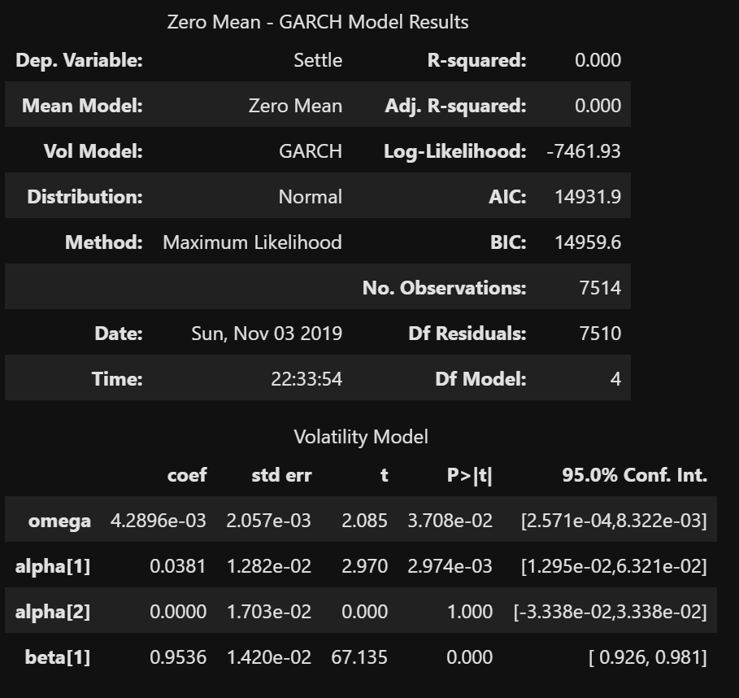

# Japanese Yen versus US dallar future movement analysis

This analysis looks at various modeling approach to forecast values of the Japanese Yen against the dollar. The techniques implemented to forecast are as follows:

- Seasonal Decomposition to determine seasonality of the series
- HP Filter Decomposition to determine trend and cyclicality
- ARMA to model the stationarized version of the time series by transforming the Settle   price to percentage change
- ARIMA to model the Settle price
- GARCH to model the volatility of the JPY
- Linear regression to model using lagged return of the JP

## 1990-2019 Trend

The value of the Japanese Yen (JPY) against the US Dollar (USD) fluctuates by relatively small amounts on a daily basis. However, visually there seems to be a up-down pattern in-between years (medium term). Looking at the long term-horzon, the value of the JPY vs USD increased from about ~7000 to ~9400 from 1900 to 2019. Interestingly when decomposed, the JPY/USD time series does not exhibit any seasonality, making it ideal for AR(I)MA modeling.

# Decomposition Using a Hodrick-Prescott Filter

1. Trend Analysis

Removing the short-term fluctuations of the Yen time series using the Hodrick-Prescott filter reveals long term trends, and perhaps some valuable insights to the value of the currency through time as shown below

2.Noise Analysis

When analyzing the noise plot it is observed that there are short-term fluctuations

# Using ARMA Model for return forecasting

ARMA model was created using the market data and the following summarized result was generated by the model

It is observed the coefficients are nearly close to zero and the P> values are insignificant since they are high above than 0.05. This doesn't provide a good fit model for forecasting.

# Using ARIMA Model for return forecasting

The ARIMA model forecasts the Yen to increase in value against USD by 4 in the next 5 days. But the forecast should be taken with precaution as the model is not a good fit for the data as the model summary shows the P> value is still higher than 0.05.

# Forecasting using GARCH model

The GARCH model forecasts an increase of the exchange rate risk of JPY against the USD.

## Covariance estimator :robust

# Using Linear Regression for Predicting returns

Comparing square root of the variance of the residuals and root mean squared errors (RMSE) it is observed how close the data points are to the model's predictions. With a lower RMSE of 0.4155,  that the model performed better on the out-of-sample data compared to in-sample data with an RMSE of 0.5962. Normally, training data has lower RMSE, but it is higher in this model.

